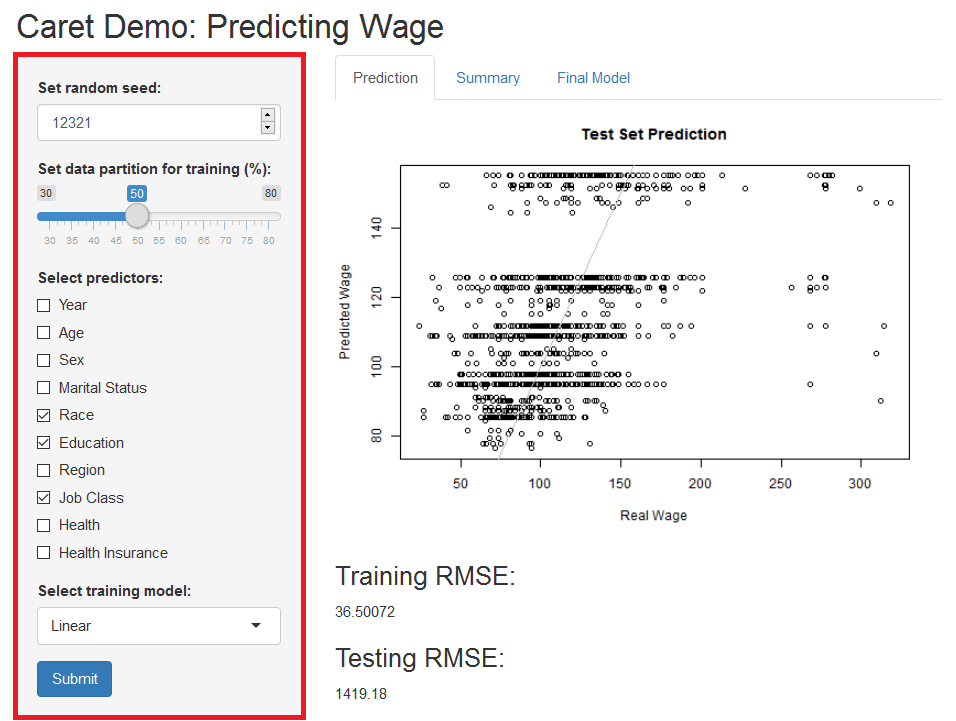
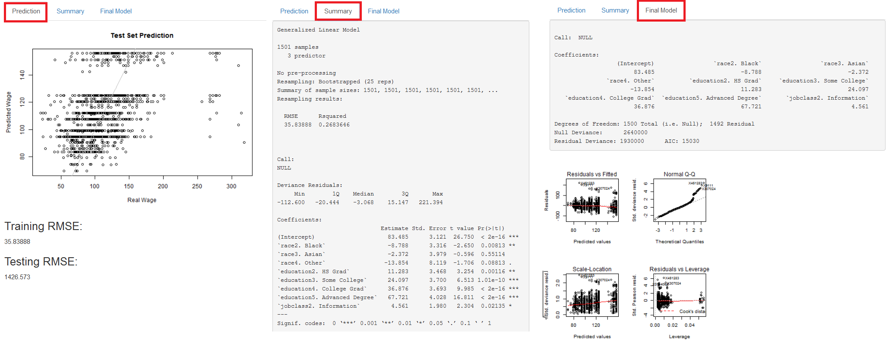

Caret Demo: Predicting Wage
========================================================
author: Hk Chen
date: 2017/3/26
autosize: true

Introduction
========================================================

This is the course project **"Developing Data Products"** on [Coursera](https://www.coursera.org/learn/data-products).

The idea is to demostrate **R caret package** capabilities with **Shiny** by building different predictive models with **Wage dataset** in ISLR package.
<small>
- The **caret package** is a set of functions that attempt to streamline the process for creating predictive models. For more details please visit <http://caret.r-forge.r-project.org/>.
- The **Wage dataset** which contains wage and other data for a group of 3000 workers in the Mid-Atlantic region was manually assembled by Steve Miller from the March 2011 [Supplement to Current Population Survey data](http://thedataweb.rm.census.gov/TheDataWeb).
- [Shiny](https://shiny.rstudio.com/) is a web application framework for R.

</small>

Predictive Models
========================================================
left: 40%
<small>
In this project, we built different models, including **generalized linear model**, **random forests** and **gradient boosting** to predict wage from other predictors.

For example, building **generalized linear model** with caret is as follow:

***

```r
library(caret)
library(ISLR)
mod <- train(wage~., data = Wage, method = "glm")
print(mod)
```

```
Generalized Linear Model 

3000 samples
  11 predictor

No pre-processing
Resampling: Bootstrapped (25 reps) 
Summary of sample sizes: 3000, 3000, 3000, 3000, 3000, 3000, ... 
Resampling results:

  RMSE      Rsquared 
  12.65576  0.9086803

 
```
</small>

UI Layout
========================================================


***
<small>
Various UI options are provided for users to customize traning models and related parameters, including:
- **random seed**: for result reproducibility.
- **data partition**: split dataset into two groups for training and testing model respectively.
- **predictors**: variables to predict wage. If nothing selected, predict with all variables.
- **training models**: select predictive model.

Users can observe and study the changes in predition results and the impact of each parameters.
</small>

Prediction Results
========================================================


The results are shown in three tab panels, include:
<small>
- **Prediction**: use trained model to predict wage in test dataset and show both training and testing RMSE for comparison.
- **Summary**: provide details of model building.
- **Final Model**: show summary and plots generated from final model.
</small>
